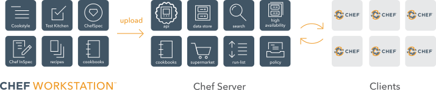

# chef.io
"Chef: The All-in-One Solution for Configuration Management, DevOps Automation, and Infrastructure Management"

This documentation aims to provide a comprehensive overview of what Chef.io is and how it can be leveraged to automate infrastructure management effectively. From setting up Chef to automating server configurations, we will walk through each aspect of its functionality with clear explanations and step-by-step demonstrations.

## Table of Contents
     
1. [Introduction](#introduction)

2. [Chef Infra](#chef-infra-overview)

3. [Chef Workstation](#chef-workstation-overview)

4. [Chef Automate](#chef-automate-overview)

5. [Chef Inspec](#chef-inspec-overview)

6. [Chef Habitat](#chef-habitat-overview)

7. [Learning More](#learning-more)

## Introduction

### Overview of Chef.io

Chef.io is an open-source platform designed to simplify and automate the management of IT infrastructure, applications, and configurations. Founded in 2008, Chef has been a leader in uniting developers and system administrators through its flagship product, **Chef Infra**, which initially focused on infrastructure automation. Over time, Chef’s capabilities have expanded significantly, providing a comprehensive suite of solutions that automate not only infrastructure but also application workflows, ensuring seamless operations from development to production.

At its core, Chef.io enables organizations to implement **Infrastructure as Code (IaC)**, ensuring environments are consistent, scalable, and reproducible. By defining infrastructure as code, teams can automate complex, repetitive tasks—such as server configurations, software deployment, and monitoring—reducing human error and improving efficiency. Chef's automation framework consists of key products like **Chef Infra** (for configuration management), **Chef Habitat** (for application automation), and **Chef InSpec** (for compliance and security). Together, these tools provide a holistic solution for managing both infrastructure and applications across various environments, whether on-premises, in the cloud, or in hybrid setups. By automating these processes, Chef helps teams ensure uniformity, accelerate deployments, and maintain a more agile, reliable IT infrastructure.  

### Why Chef.io for Automation?

Automation is key to improving efficiency and reliability in modern IT operations, and Chef.io is purpose-built to address these needs. As organizations grow, the complexity of managing infrastructure and deploying applications also increases. Chef.io automates these tasks, providing a declarative approach to managing infrastructure at scale.

Chef’s framework allows IT teams to treat their infrastructure and applications as code, meaning they can define how systems should be configured, monitor those configurations, and ensure consistency across environments. This level of automation reduces manual work and human error, while also enabling faster provisioning of servers, quicker deployments, and reliable infrastructure management.

Chef.io is particularly beneficial for organizations that adopt **DevOps** practices because it integrates well with continuous integration (CI) and continuous deployment (CD) pipelines, streamlining the entire software development lifecycle from development to production.

### Benefits of Using Chef.io

Chef.io offers several critical benefits to organizations, particularly in automating infrastructure and managing configurations:

- **Consistency Across Environments**: By defining configurations as code, Chef ensures that the same setup can be replicated across development, testing, and production environments, reducing inconsistencies and minimizing errors caused by manual configurations.

- **Scalability**: Chef scales easily from managing a handful of servers to thousands of nodes across diverse environments (cloud, on-premise, or hybrid). It ensures that large infrastructures can be managed effortlessly using automated scripts.

- **Faster Deployment**: Automating infrastructure provisioning and application deployment significantly reduces the time needed to configure servers or roll out new software versions, accelerating the overall deployment process.

- **Reduced Human Error**: By automating repetitive tasks and following predefined configurations, Chef minimizes the risk of errors that come with manual intervention, leading to a more stable and reliable infrastructure.

- **Enhanced Collaboration Between Teams**: Chef bridges the gap between development and operations teams by providing a common platform for defining, testing, and applying infrastructure and application configurations, thereby improving cross-team collaboration.

- **Compliance and Security**: With Chef InSpec, Chef.io not only automates infrastructure but also ensures that systems comply with security and operational policies. Teams can write compliance tests as code, ensuring that infrastructure remains secure and compliant.

## Chef Infra Overview

Chef Infra is the core configuration management tool within Chef.io. It transforms infrastructure into code, allowing organizations to automate the provisioning, configuration, and ongoing management of systems, whether they operate in the cloud, on-premises, or in a hybrid environment. Chef Infra automates how infrastructure is configured, deployed, and managed across networks of any size, ensuring consistency, scalability, and reliability. By leveraging Chef Infra, organizations can continuously automate their infrastructure, ensuring that it remains compliant with business policies.

### Uploading your code to Chef Infra Server

The Chef Infra Server is the central hub of the Chef ecosystem, responsible for storing and distributing configuration data to managed nodes. It acts as the authoritative source for all infrastructure code and policies. The server stores cookbooks (collections of infrastructure code), roles, environments, and data bags that define how nodes should be configured and behave.

When code is developed and tested on a local workstation, it is uploaded to the Chef Infra Server using the knife command-line tool. The server then stores this data and makes it available to the nodes. Acting as the core of the Chef infrastructure, the Chef Infra Server easily scales to manage thousands of nodes, whether they exist in the cloud, on-premises, or in hybrid environments.

### Configuring your nodes with Chef Infra Client

The Chef Infra Client is the agent installed on each node you manage with Chef. Nodes can be virtual machines, containers, or physical servers, and they rely on the Chef Infra Client to retrieve configuration data. The client periodically communicates with the Chef Infra Server to retrieve the latest configurations stored in the cookbooks, roles, and environments.

The Chef Infra Client is designed to ensure that each node converges to the desired state as defined in the policies on the server. If a node’s current configuration does not align with the instructions from the cookbooks, the client applies the necessary changes to bring it into compliance. This iterative process helps prevent configuration drift across the network, ensuring the infrastructure remains consistent, compliant, and up to date. Chef Infra Client runs autonomously, only making changes when needed, which helps optimize resource usage and reduces the need for manual intervention.

## Chef Workstation Overview

Chef Workstation is the starting point for infrastructure automation with Chef. It provides all the necessary tools for system administrators and developers to author, test, and maintain infrastructure as code. Chef Workstation combines ad hoc remote execution, configuration tasks, remote scanning, cookbook creation tools, and robust dependency management, all in one easy-to-install package. It simplifies the workflow by integrating essential tools for developing and deploying infrastructure automation.

**Chef Workstation Workflow**
Chef Infra defines a clear, iterative workflow for cookbook development:

- **Generate Cookbooks**: Start by running chef generate cookbook <MY_COOKBOOK_NAME>. This creates a skeleton cookbook with testing configurations for Test Kitchen and Chef InSpec.

- **Write and Test**: Develop recipes and resources, then use Cookstyle to lint your code and Test Kitchen to simulate how it behaves in a real environment.

- **Acceptance Testing**: Test your cookbook in an environment that mirrors your production setup to ensure it behaves as expected.

- **Deploy**: After successful testing and validation, deploy the cookbook to your production environment, ensuring all tests have passed.

This iterative workflow allows you to develop, test, and deploy infrastructure automation efficiently while minimizing errors.

## Chef Automate Overview

Chef Automate is the enterprise platform that provides visibility, control, and collaboration across your infrastructure, applications, and security policies. It integrates seamlessly with Chef Infra, Chef Habitat, and Chef InSpec to offer a unified platform for automating infrastructure, managing application lifecycles, and enforcing compliance policies.

Chef Automate is designed to streamline the management of complex IT environments, providing an end-to-end automation solution. By offering a comprehensive suite of tools, Chef Automate enables teams to develop, deploy, and manage infrastructure and applications with confidence, while maintaining compliance and visibility throughout the process.

**Key features of Chef Automate include:**

- **Visibility and Monitoring**: Chef Automate provides real-time insights into your infrastructure, applications, and compliance status. The Chef Automate Dashboard presents a visual representation of your systems’ health, showing detailed information on configurations, application status, and compliance checks. This allows teams to monitor changes, track progress, and quickly identify any issues.

- **Workflow Automation**: Chef Automate enables teams to define and manage pipelines for continuous integration and continuous delivery (CI/CD). The workflow automation feature integrates with version control systems like Git, allowing infrastructure and application changes to move through testing and production environments seamlessly. This ensures that only validated changes are deployed, reducing the risk of errors.

- **Compliance Automation**: With Chef Automate, organizations can enforce compliance policies through Chef InSpec. It allows teams to write compliance controls as code and automatically validate infrastructure and applications against regulatory standards such as GDPR, HIPAA, and PCI-DSS. Continuous compliance checks ensure that your systems always meet security and operational standards.

- **Collaboration and Governance**: Chef Automate promotes collaboration by providing a centralized platform where operations, security, and development teams can work together. The platform offers role-based access control (RBAC), enabling administrators to control who can view, modify, and deploy changes. This governance helps prevent unauthorized changes and ensures accountability.

## Chef Inspec Overview

Chef InSpec is an open-source framework for defining and enforcing security and compliance policies as code. It allows you to automate the testing and validation of your infrastructure's security posture, ensuring that it adheres to internal standards, regulatory requirements, and industry best practices. With Chef InSpec, teams can continuously monitor and remediate issues related to compliance across cloud, on-premises, and hybrid environments.

Chef InSpec works by enabling you to write compliance tests as code, which can be executed on servers, containers, and other systems. These tests assess whether the system configurations, installed software, and running processes meet specified compliance and security criteria.

## Chef Habitat Overview

Chef Habitat is an application automation platform designed to simplify the way applications are built, deployed, and managed across various environments, including on-premises, cloud, and containerized systems. Chef Habitat focuses on automating the entire application lifecycle by packaging applications with everything they need to run, ensuring they are portable and easy to manage, regardless of the underlying infrastructure.

Chef Habitat’s key strength lies in decoupling applications from the environment they run in, allowing developers to focus on the application itself rather than worrying about infrastructure-specific details. It provides a consistent, repeatable process for packaging, deploying, and managing applications across multiple platforms.

## Learning More

If you’re interested in getting hands-on experience, go to the Directory Chef for tutorials, information about formal training resources.
